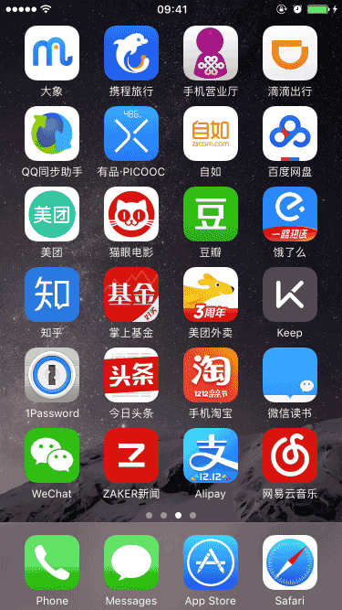
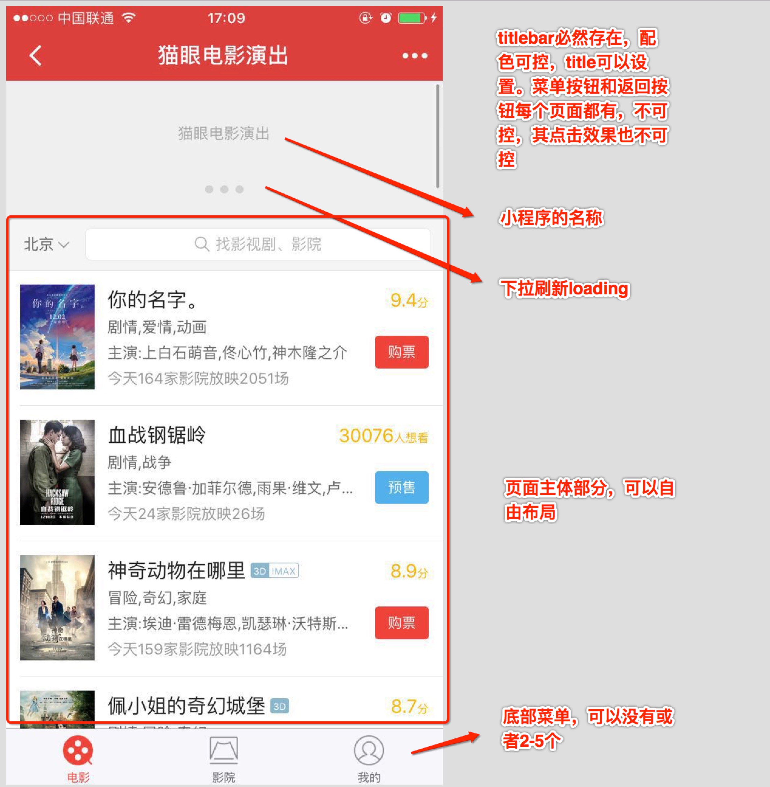

# 微信小程序

最新火的一塌糊涂的微信小程序到底是个什么鬼？笔者有幸第一时间成为了微信小程序的开发者，给大家分享一下开发心得。

### 与传统app的区别

笔者认为小程序最大的优势就是小，微信规定大于1M的代码包不能上传，用户首次进入会下载1M的代码包，实际使用体验非常优秀，毕竟native app也有启动时间。其他的特点比如绑定微信账号等，其实native app也可以做到，而且还不会被微信绑架。微信小程序运行在微信中，而传统app是直接运行在操作系统上，可以类比的产品是chrome app，区别是chrome app是桌面端的，每个chrome app都有独立窗口，只是在切换应用时操作系统会认为chrome和chrome app是同一个应用，稍有不便，除此之外几乎和native app一模一样，但是移动端的微信不能实现多窗口，这一点十分尴尬，如下图，感受一下

- 对于用户而言，在html5和native之间多了一个选择，16G手机的福音
- 对于企业而言，开发小程序的成本低于native app，技术成本的降低会让小程序更加普遍
- 对于微信而言，功能更强大的微信用户粘性更强，地位更加稳定

#### 问答

- **微信小程序是html5吗？**
不是，微信小程序是利用web技术开发native页面。体验比html5要好很多，比纯的native应用稍差（因为中间有一个转义的过程，安卓系统可能更差一些）。小程序中不能嵌入web页面，也不能跳转到web页面。
- **个人用户可以申请小程序吗？**
不可以，小程序目前只对企业、政府、媒体和其他组织开放（其他组织是什么...反正就是不对个人开放）。

### 小程序的边界

微信为了更方便地管理小程序，给小程序添加了诸多限制，其中页面整体的结构就限制的非常死

- 代码包的大小最多1M（保证用户第一次快速下载）
- 页面的层级最多5层
- 只支持https和wss协议，TLS版本1.2
- 小程序被挂起之后，只能播放背景音乐
- 不能主动给用户推送微信消息，只有当用户完成某个操作时，比如付款，这时可以给用户推送一个付款成功的消息，而且消息有固定的模板，自由发挥的空间很小，也可以延迟发送这条消息，最多延迟7天

#### 问答

- **能不能做个“微信”？**
不能，因为没有主动推送消息的能力
- **可以把页面做成沉浸式吗？**
不能
- **能做游戏吗？**
由于渲染机制和代码包大小等原因，很难做出效果很好的游戏，2048、象棋还是可以的，但小游戏不能通过审核
- **能做直播吗？**
不能
- **如果已经到了第5级页面，可以使用图片预览和地图预览吗？**
可以
- **每个小程序最多1M，那么1G内存就可以装1024个小程序咯？**
如果只安装不运行确实可以，1M只是代码包的大小，实际运行起来会占用大得多存储空间，小程序的本地缓存限制为5M，网络图片会额外占用缓存

### 入口与传播

微信客户端已经支持小程序运行，入口还没有对用户开放，开发者通过扫码进入小程序。前段时间张小龙发了个朋友圈，系统桌面上都是微信小程序，似乎预示着小程序会有系统桌面的入口，简直吊炸天。那么ios怎么办呢，其实ios下也是可以做桌面图标，变通一下，因为Safari可以添加网页到桌面，可以在打开的网页中跳转到微信小程序，网页云音乐的听歌识曲就是这么干的，体验略微有些奇怪，不知道微信会不会这么干

<image src="1.jpg" alt="桌面进入" style="max-height: 300px" />

### 开发技巧

开发小程序必须使用微信官方提供的开发工具，因为编译和上传只能通过开发工具，像是要搞封闭，开发工具需要使用微信登录，开发者才可以登录，网上可以下到破解版（微信开发工具是使用node-webkit开发的，代码都在明处），小程序使用web相关技术开发，适合web前端开发者，主要涉及到以下4种文件

- wxml，模板文件，就是标准的xml格式
	- 标签属性包含wx的命名空间用来做条件渲染和列表渲染，
	- 双层大括号用来绑定数据，其中可以写js运算符，但不能调用方法
- wxss，样式文件，写法同css，支持大部分css
	- 选择器的连接符只支持空格
	- 支持flex、transform，布局很强大
	- 支持transition、@keyframe，动画很强大
	- 支持before和after伪元素
	- 新的单位rpx，1rpx表示屏幕宽度的1/750，iphone 6s下完美显示，其他宽度的手机下会有少量偏差
- js，逻辑代码文件，运行容器不同于浏览器和node
	- 支持commonjs的模块化写法
	- 支持部分es6特性，Promise需要自己引入库
	- 没有浏览器中的window对象，也没有node中的global对象
	- 除了ECMAScript语法中的全局对象之外，还有以下全局对象：
		- wx，微信api都挂在wx对象上
		- getApp，获取app对象
		- getCurrentPages，获取当前的页面堆栈
		- App，用于注册app，其中包含app的生命周期方法
		- Page，用于注册页面，其中包含页面的生命周期方法
		- require，引入其他模块
		- module，当前模块，可以使用module.exports导出
- json，配置文件，标准的json文件

代码包的文件结构如下：

<image src="3.jpg" style="max-height: 200px" />

整体结构非常简单易懂，也很符合“小”的特性，小程序是一个阉割版的react-native，微信提供组件和api，实际使用中出现以下问题

- wxss中可以定义和引用模板，但没有全局layout
- wx.request 同时只能发5个请求，多了直接报错，pending不可以吗
- 对于es6/es2015特性支持不完整，存在兼容性问题
- 不能自定义组件，写过react、vue等代码再写这个会有点难受
- 写多了less再写css也很难受

综合以上问题，我们认为有必要在开发时引入预编译机制，补足开发过程中一些不好的体验

<image src="2.pic.jpg" style="max-height: 200px" />

其中src目录为源代码，build目录为编译后的代码包，编译过程主要包含以下内容

- es6/es2015转es5
- less转css，包含全局变量和mixin
- wxml模板文件中加入全局模板，比如网络错误等提示
- 替换Page对象，在其中加入通用方法、监控等

### 相关链接

- [微信小程序官方介绍文档](https://mp.weixin.qq.com/cgi-bin/registermidpage?action=wxopenintro)